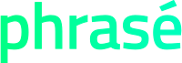

<p align="center">
    <a href="https://github.com/documente/phrase">
        
    </a>
</p>

<h3 align="center">Welcome to Phrasé</h3>

<p align="center">
A fluent automated testing library for web applications
</p>

## Project Overview

Phrasé (pronounced /fraz-ay/) is a user-centric test language and a set of accompanying tools designed specifically for testing web applications.
It's designed around the following principles:

- **Readability for All**: Phrasé ensures that test cases are easily understood by both the development team and,
uniquely, by **end-users**. It fosters a shared language that promotes collaboration.
- **Agile Response to Evolution**: Recognizing the dynamic nature of applications, Phrasé embraces change without requiring
a complete overhaul of automated tests.
- **Swift Progress from Idea to Test**: Phrasé aims at minimizing the cycle between requirement conception and test execution.
Designers can transform ideas into executable tests for quick feedback and seamless iterations.

Phrasé is an integral part of the [Documenté](https://github.com/documente/) project,
a practical initiative that seamlessly integrates automated tests into your user-facing documentation.

## Core concepts

### Test Scenario Structure

A test scenario is structured as a sentence, resembling natural language. It utilizes keywords found in Behavior-Driven-Development such as:

- `given` to define prerequisites for the test.
- `when` to specify user actions on the system, such as clicking a button or entering text.
- `then` to articulate expectations on the system state, such as the visibility of a message or the disabled status of a text input.

Here's an example of a test sentence :

```
given I visit "https://my-awesome-app.io"
when I click on welcome page greet button
then welcome message should be visible
```

Learn more about the language structure in the [Language Overview](docs/language-overview.md).

### System Under Test (SUT) Representation

In the tests, the System Under Test (SUT) is depicted as a YAML or JSON tree structure, with each node representing a component of the application. Nodes are assigned names and come with selectors.

Here's an illustrative example:
```yaml
welcome page:
  _selector: "#welcome"
  greet button: button
  welcome message: span.message
login form:
  _selector: [data-test-id="login-form"]
  login field: input[type="text"]
  password field: input[type="password"]
  confirm button: button
```

This declarative approach offers inherent flexibility and facilitates test reuse. It eliminates the need for investing time and effort in a Page Object Pattern, mitigating the risk of misalignment with the evolving application under test.

### Fluent Component Selection

Within test sentences, component selection is facilitated by traversing the System Under Test (SUT) tree representation. For instance, consider the following tree:

```yaml
foo:
  _selector: "#foo"
  bar: "#bar"
  baz: "#baz"
```

You can select the `bar` component by specifying the path "foo bar".

The most recently selected node is preserved, allowing you to omit parts of the hierarchy in subsequent paths. Node resolution follows these rules:

- Search among the children of the most recently selected node.
- Explore among the siblings of the most recently selected node.
- Resolve a node starting from the root and navigating down.

This fluent selection mechanism enhances the ease with which components can be identified and interacted with in your test sentences.

### Actions

An **action** refers to a specific interaction or operation performed on the application under test (SUT). Actions can
take two forms:
- User actions
- System state changes

#### User actions

These interactions typically mirror user actions, such as clicking buttons, entering text, navigating through pages, or interacting with various elements.

Actions are integral components of test scenarios, encapsulating the steps required to simulate user behavior and interactions with the application. They serve as the building blocks for constructing meaningful and comprehensive test cases.

The library provides a range of built-in user actions, simplifying the testing process for common operations, including:
- visit
- click
- type
- clear
- hover

You can also define custom user actions. This allows testers and developers to define actions that are specific to their application requirements or to encapsulate complex sequences of interactions.

Example custom user action :

```
When I enter "Hello, World!" in message field
then welcome message should be visible
done

In order to enter {{text}} in $element:
- I click on its button
- I type "{{text}}" into input
- I click confirm button
done
```

Custom actions are structured with a header following the form `In order to [action name]:`, followed by a bullet list of statements detailing the steps required for the action to complete. These custom actions can also define named parameters using the mustache-like syntax `{{parameter name}}`.

#### System state changes

System state changes are used to define the initial state of the application under test (SUT) or to simulate changes in the system state. These changes can be used to set up the application for testing or to simulate specific scenarios.

### Assertions

Assertions refer to statements or conditions that validate the expected outcomes of specific actions or interactions within your test scenarios. These statements act as checkpoints, ensuring that the application under test behaves as anticipated.

The library provides built-in assertions such as :
- should be visible
- should exist
- should have text

As every application is different, you can also define custom assertions or overwrite the existing ones.

Example custom assertion:

```
When I click on login form confirm button then login form should show login error message
done

For $element to show login error message:
- its error message should be visible
- it should have text "Please check your credentials"
done
```

Custom assertions are built with a header following the form `For $element to [assertion name]:`, followed by a bullet list of statements.

## Contributing

Any contributions you make are *greatly appreciated*.

For suggestions and improvements, feel free to fork the repo and create a pull request. You can also simply open an issue with the tag "enhancement".

Don't forget to give the project a star! Thanks again!

## License

Distributed under the GNU GPL3 License.

See `LICENSE` for more information.

## Contact

Pierre-Clément KERNEIS - pc.kerneis@gmail.com

Project Link: https://github.com/documente/phrase
